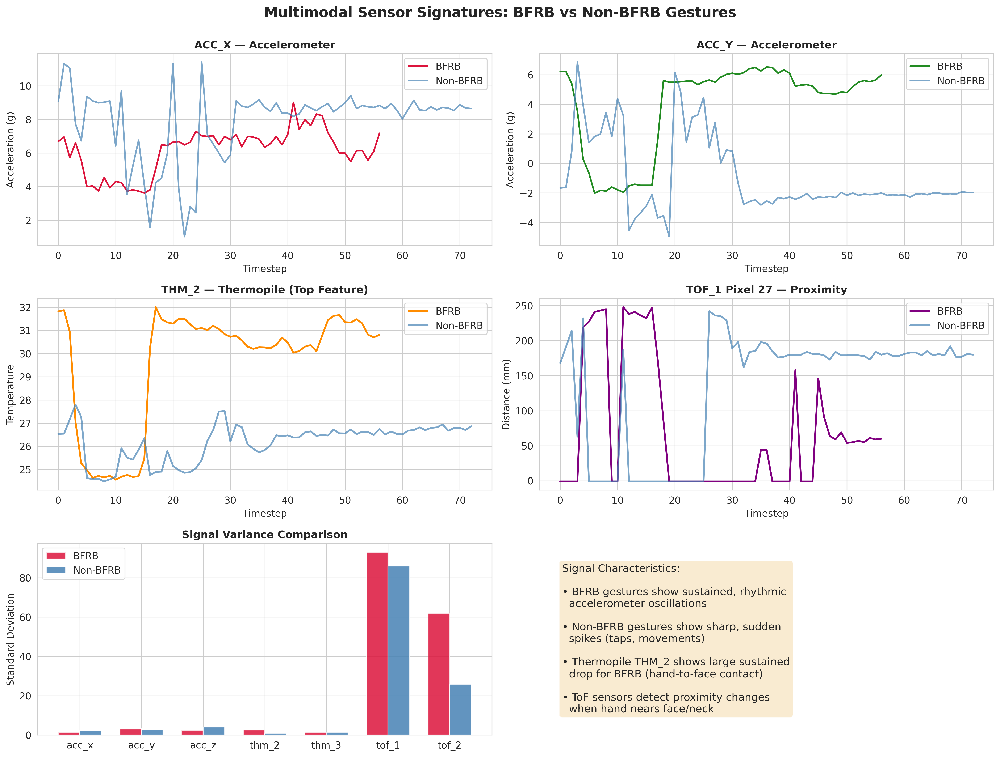
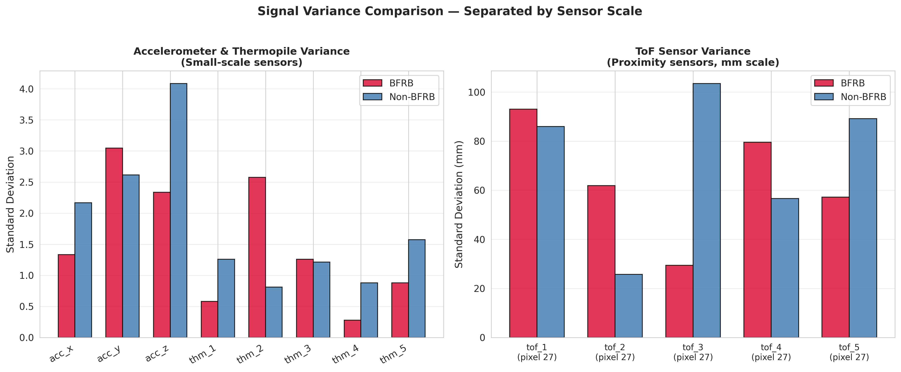
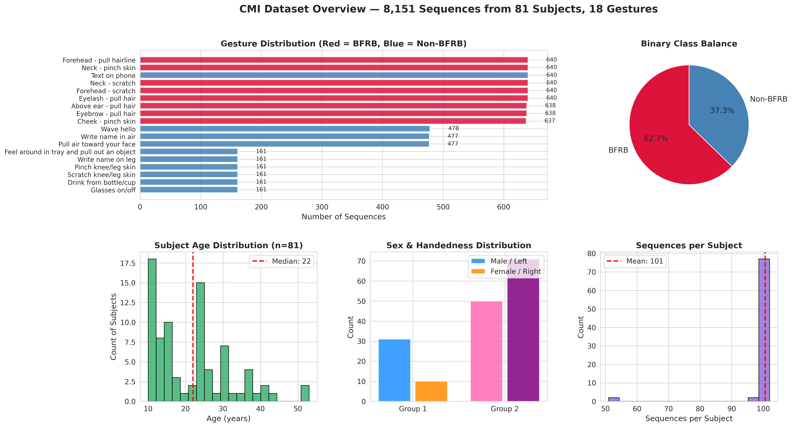
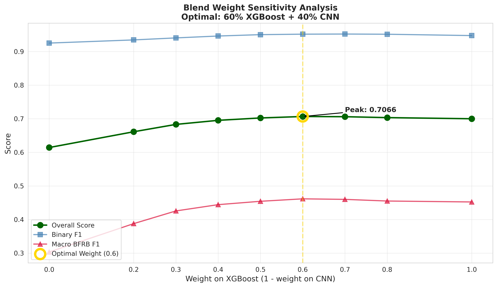
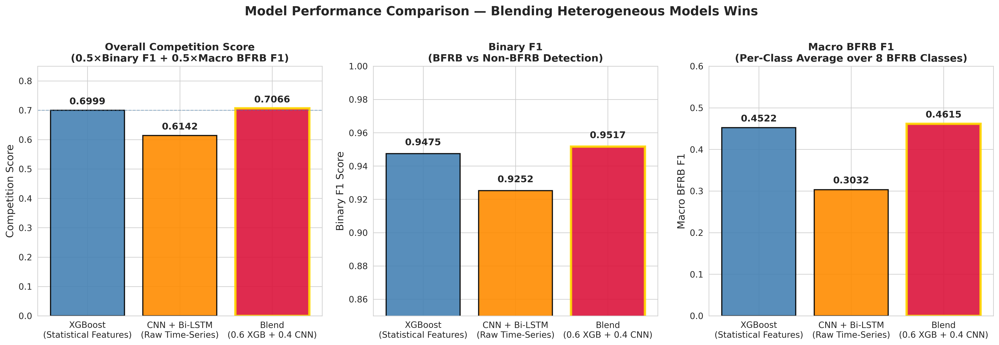
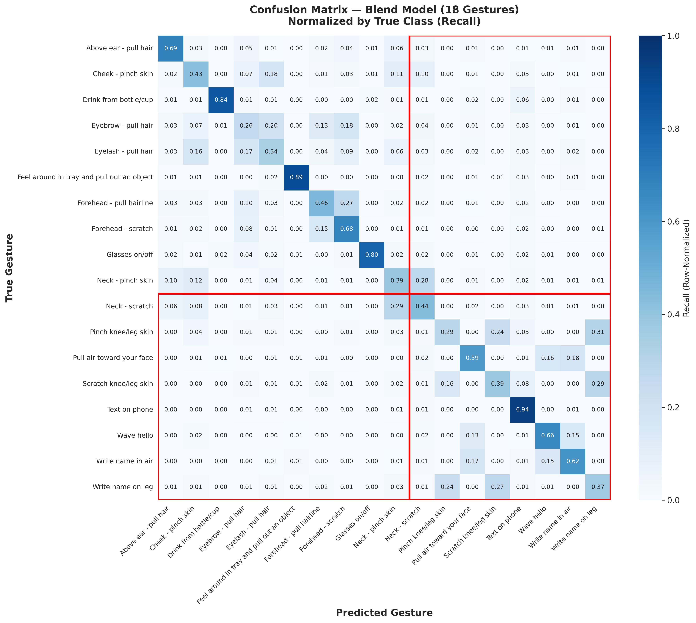
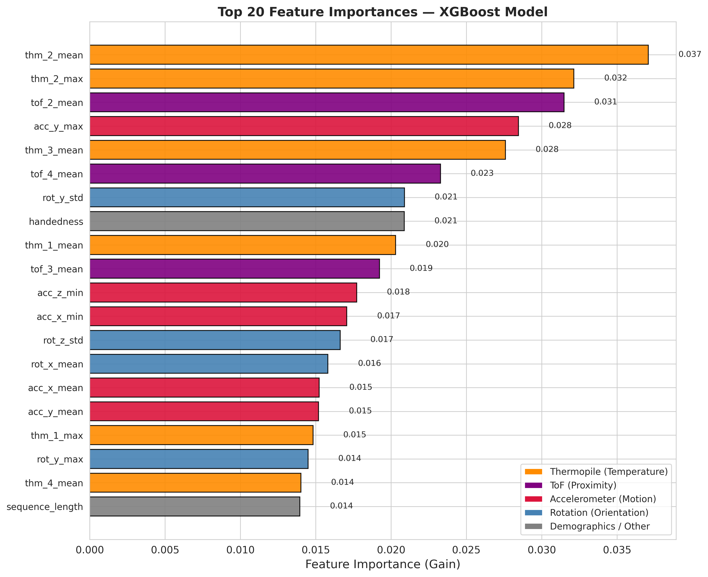
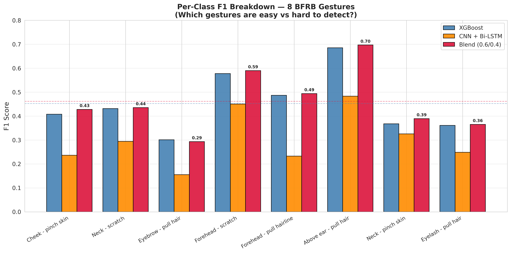

# 🧠 CMI - Detect Behavior with Sensor Data

[](https://www.python.org/)
[](https://pytorch.org/)
[](https://xgboost.readthedocs.io/)
[](https://scikit-learn.org/)
[](https://www.kaggle.com/competitions/cmi-detect-behavior-with-sensor-data)

## 📖 Overview

This project tackles the Child Mind Institute (CMI) - Detect Behavior with Sensor Data Kaggle competition, a multimodal time-series classification task in the domain of mental health wearables.

**The goal:** Classify wrist-worn sensor data into 18 gesture classes, distinguishing Body-Focused Repetitive Behaviors (BFRBs), such as hair pulling, skin pinching, and scratching, from everyday non-BFRB gestures. Early detection of BFRBs is clinically valuable for diagnosing and treating conditions like trichotillomania and excoriation disorder.

The data comes from the Helios device, which contains three sensor modalities:
- **IMU (7 channels):** 3-axis accelerometer + 4-channel orientation quaternion
- **Thermopiles (5 channels):** Infrared temperature sensors for detecting hand-to-skin contact
- **Time-of-Flight (5 × 8×8 grids):** Proximity sensors for distance measurement

### 🏆 Key Results

| Model | Competition Score | Binary F1 | Macro BFRB F1 |
|-------|------------------:|----------:|--------------:|
| XGBoost (statistical features) | 0.6999 | 0.9475 | 0.4522 |
| CNN + Bi-LSTM (raw time-series) | 0.6142 | 0.9252 | 0.3032 |
| **Blend (0.6 × XGB + 0.4 × CNN)** | **0.7066** 🏆 | 0.9517 | 0.4615 |

**Evaluation metric:** `0.5 × Binary F1 + 0.5 × Macro F1 over 8 BFRB classes`, computed via subject-wise GroupKFold cross-validation (81 subjects, no subject leakage).

---

## 💡 The Core Insight

> With only 81 subjects in the training set, a gradient-boosted tree on engineered statistical features outperformed a deep learning model on raw time-series (+0.086 score). However, the two models made complementary errors, and blending them yielded the best overall result.

This is a real-world ML lesson. Model complexity must be matched to data availability. Deep learning is powerful, but it needs diversity and 81 subjects is not enough to learn robust temporal patterns from scratch. Feature engineering still wins when data is limited.

---

## 🔬 Methodology

### 1. Exploratory Data Analysis

I analyzed the physical signatures of BFRB vs. non-BFRB gestures across all three sensor modalities:



**Observations:**
- BFRBs show sustained, rhythmic accelerometer oscillations and a sustained thermopile drop (hand contact cooling the sensor).
- Non-BFRBs show sharp, sudden spikes (phone taps) and erratic ToF readings.



### 2. Dataset Challenges



- 8,151 sequences across 81 subjects (average 101 sequences per subject).
- 18 gesture classes with severe imbalance — BFRB classes have ~640 sequences each, while rarer non-BFRB gestures have only 161.
- 62.7% BFRB vs 37.3% non-BFRB binary split.
- Roughly 50% of test data will have missing thermopile/ToF sensors, forcing the model to generalize using IMU-only streams.

### 3. Feature Engineering (XGBoost Path)

For each of the 8,151 sequences, I extracted a 90-dimensional statistical feature vector by aggregating sensor signals over time:

- **IMU (7 channels × 4 stats)**: mean, std, min, max of acceleration and orientation
- **Thermopile (5 channels × 5 stats)**: mean, std, min, max, range (range captures the temperature drop during touch)
- **ToF (5 sensors × 5 stats)**: spatial mean across the 8×8 grid, then temporal mean/std/min/max/range
- **Demographics**: age, sex, handedness, height, shoulder-to-wrist, elbow-to-wrist

### 4. Deep Learning (CNN Path)

For the neural approach, each sequence was:
1. **Padded/truncated** to 100 timesteps
2. **Standardized** per sequence (zero mean, unit variance)
3. **Fed into a CNN + Bi-LSTM** with attention pooling:

Input (27 channels × 100 timesteps)
↓
Conv1D(64) → BN → ReLU → MaxPool → Dropout
↓
Conv1D(128) → BN → ReLU → MaxPool → Dropout
↓
Conv1D(128) → BN → ReLU → Dropout
↓
Bi-LSTM(128, 2 layers) → Attention Pooling
↓
FC(128) → FC(18 classes)


Trained with class weights, gradient clipping**, and cosine LR scheduling to handle imbalance and prevent NaN losses.

### 5. Blending Strategy

I swept the blend weight from 0.0 to 1.0 in steps of 0.1:



The optimal weight is **0.6 × XGBoost + 0.4 × CNN**, which outperforms either model alone.

---

## 📊 Results

### Model Comparison



### Confusion Matrix (Blend Model)



**Key observations:**
- Non-BFRB gestures like "Text on phone" (0.94) and "Feel around in tray" (0.89) are almost perfectly classified.
- **Similar BFRB gestures confuse each other**: "Eyebrow - pull hair" vs "Forehead - pull hairline" share nearly identical arm trajectories and thermal signatures.

### Feature Importance (XGBoost)



**The thermopile features dominate** — `thm_2_mean` and `thm_2_max` are the top two features. This validates the physical hypothesis: BFRB detection is fundamentally a touch detection problem, and thermopiles directly measure the thermal signature of hand-to-skin contact.

### Per-Class F1 Breakdown (BFRB Gestures)



| BFRB Gesture | XGBoost | CNN + Bi-LSTM | Blend | Difficulty |
|--------------|--------:|--------------:|------:|:----------:|
| Above ear - pull hair | 0.685 | 0.483 | **0.697** | 🟢 Easy |
| Forehead - scratch | 0.577 | 0.450 | **0.590** | 🟢 Easy |
| Forehead - pull hairline | 0.487 | 0.233 | **0.494** | 🟡 Medium |
| Neck - scratch | 0.431 | 0.294 | **0.435** | 🟡 Medium |
| Cheek - pinch skin | 0.408 | 0.236 | **0.428** | 🟡 Medium |
| Neck - pinch skin | 0.367 | 0.325 | **0.389** | 🟠 Hard |
| Eyelash - pull hair | 0.361 | 0.249 | **0.365** | 🟠 Hard |
| Eyebrow - pull hair | 0.301 | 0.155 | 0.293 | 🔴 Very Hard |
| **Mean** | 0.452 | 0.303 | **0.461** | — |

---

## 🛠️ Technologies Used

- **Languages:** Python 3.8+
- **Deep Learning:** PyTorch (CNN + Bi-LSTM with attention)
- **Machine Learning:** XGBoost, Scikit-Learn
- **Data:** Pandas, NumPy
- **Visualization:** Matplotlib, Seaborn
- **Environment:** Kaggle Notebooks (GPU-accelerated)

---

## 📁 Project Structure
cmi-bfrb-detection/
├── notebook/
│ └── cmi_bfrb_detection.ipynb # Full Kaggle notebook
├── images/
│ ├── viz1_signal_patterns.png
│ ├── viz1b_rescaled_variance.png
│ ├── viz2_class_distribution.png
│ ├── viz3_model_comparison.png
│ ├── viz4_blend_sensitivity.png
│ ├── viz5_confusion_matrix.png
│ ├── viz6_feature_importance.png
│ └── viz7_per_class_f1.png
├── README.md
└── requirements.txt

## 🚀 How to Run

1. **Clone the repository:**
   ```bash
   git clone https://github.com/Adnyeus/cmi-bfrb-detection.git
   cd cmi-bfrb-detection

2. Install dependencies:
   ```bash
   pip install -r requirements.txt

4. Download the dataset from Kaggle and place it in the data/ folder.
5. Open the notebook:
   ```bash
   jupyter notebook notebook/cmi_bfrb_detection.ipynb

## 🔑 Key Takeaways

- Feature engineering still matters. With limited subjects (81), engineered statistical features beat raw time-series modeling by a wide margin.
- Blend heterogeneous models. XGBoost and CNN make different errors — their union beats either alone.
- Always compute the actual competition metric. The initial CNN's binary F1 looked great (0.95), but its macro BFRB F1 was poor (0.30). The competition metric reveals the truth.
- Physical intuition guides modeling. Feature importance confirmed that thermopile features (touch detection) drive performance — exactly as expected from the physical mechanism of BFRBs.

## 📝 Author
Ebad Naeem
[Github](https://github.com/Adnyeus) | [LinkedIn](https://www.linkedin.com/in/ebad-naeem-7984522b8)

## 🙏 Acknowledgments
- Kaggle and the Child Mind Institute for hosting the competition and providing the dataset.
- The open-source community for PyTorch, XGBoost, and Scikit-Learn.